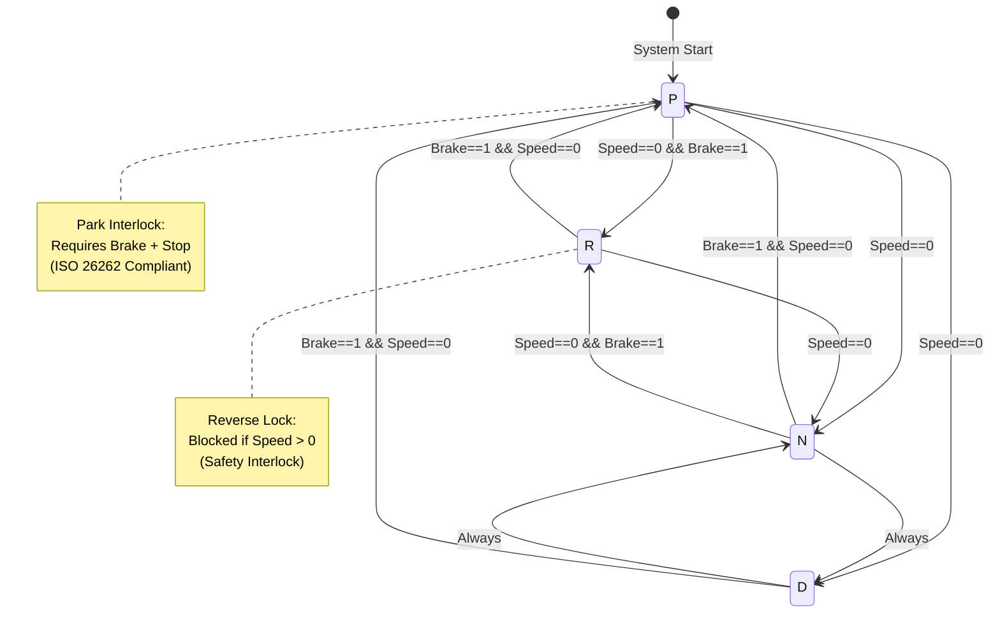

# 🚗 AutoSpeed-Control

**C++ Automotive Speed Control Simulation with Safety Logic Verification**


[](https://github.com/duytan1412/AutoSpeed-Control/actions/workflows/ci.yml)

---

## 📋 Description | Mô tả

**🇬🇧 English:**  
A simulation project demonstrating **Design Verification (DV)** and **Safety-Critical Logic** for Automotive software. The system models an Automatic Transmission Controller and Throttle/Brake system, verified through professional-grade test cases following **ISO 26262** safety mindset.

**🇻🇳 Tiếng Việt:**  
Dự án mô phỏng thể hiện kỹ năng **Design Verification (DV)** và **Logic An toàn (Safety-Critical)** cho phần mềm ô tô. Hệ thống mô phỏng Bộ điều khiển hộp số tự động và hệ thống Ga/Phanh, được xác thực bởi các kịch bản kiểm thử chuẩn công nghiệp theo tư duy **ISO 26262**.

---

## 🔄 System State Machine | Máy trạng thái hệ thống

The transmission controller implements a **Finite State Machine (FSM)** for gear management - a fundamental concept in **Digital Logic Design** and **Sequential Circuit** verification.



**Key FSM Properties | Đặc tính máy trạng thái:**
- **4 States**: P (Park), R (Reverse), N (Neutral), D (Drive)
- **Transition Guards**: Speed and Brake conditions prevent unsafe gear shifts
- **Safety Interlocks**: Reverse lock (Speed > 0) and Park interlock (requires brake)
- **Sequential Logic**: State changes synchronized with system clock

> **Why FSM Matters for Chip Design:**  
> In semiconductor verification, every control system is modeled as a state machine. This project demonstrates understanding of **state encoding**, **transition coverage**, and **safety properties** - core skills for RTL verification engineers.

---

## 🧠 Verification Strategy | Chiến lược xác thực

| Strategy | Description | Mô tả |
|----------|-------------|-------|
| **Boundary Value Analysis (BVA)** | Test limits: 0 and MAX_SPEED | Kiểm tra giới hạn: 0 và tốc độ tối đa |
| **State Transition Coverage** | Validate all FSM transitions (P↔R↔N↔D) | Xác thực mọi chuyển trạng thái |
| **Safety Interlock Verification** | Assert safety rules with `ASSERT_FALSE` | Kiểm tra khóa liên động an toàn |
| **Decision Coverage** | **Achieved 100%** for safety-critical states | **Đạt 100%** cho trạng thái an toàn |

---

## 🛡️ Safety Rules (ISO 26262 Mindset)

| Rule | Description | Code Logic |
|------|-------------|------------|
| **Reverse Lock** | Block R gear when speed > 0 | `if (speed_ > 0) return false;` |
| **Park Interlock** | P requires Stop + Brake | `if (!brake_ || speed_ > 0) return false;` |
| **Brake Override (BOS)** | Brake > Throttle priority | `if (brake_) decelerate();` |
| **Neutral Safety** | No acceleration in N | `if (gear_ == 'N') ignore_throttle;` |

---

## 🚦 Requirements Traceability Matrix (RTM)

Mapping Safety Requirements to Verification Test Cases:

| Requirement ID | Description | Test Case | Status |
|---|---|---|---|
| **REQ-001** | Vehicle must stop before shifting to Park | `SafetyTest.GearParkRequiresBrake` | ✅ PASS |
| **REQ-002** | Reverse Gear inhibited while moving forward | `SafetyTest.PreventReverseWhileDriving` | ✅ PASS |
| **REQ-003** | Brake MUST always override throttle input | `SafetyTest.BrakeOverrideThrottle` | ✅ PASS |
| **REQ-004** | Speed cannot exceed MAX_SPEED limit | `BoundaryTest.MaxSpeedLimit` | ✅ PASS |
| **REQ-005** | Negative speed is physically impossible | `BoundaryTest.SpeedNeverNegative` | ✅ PASS |


---

## ✅ Verification Results | Kết quả xác thực

**🎯 Coverage Achievement: 100% Decision Coverage for Safety-Critical States**  
*(Brake Override, Gear Shifting Interlocks)*

```
[==========] Running 10 tests from 3 test suites.
[----------] Global test environment set-up.

[----------] 6 tests from SafetyTest
[ RUN      ] SafetyTest.PreventReverseWhileDriving
[       OK ] SafetyTest.PreventReverseWhileDriving (0 ms)
[ RUN      ] SafetyTest.BrakeOverrideThrottle
[       OK ] SafetyTest.BrakeOverrideThrottle (0 ms)
[ RUN      ] SafetyTest.AllowReverseWhenStopped
[       OK ] SafetyTest.AllowReverseWhenStopped (0 ms)
[ RUN      ] SafetyTest.GearParkRequiresBrake
[       OK ] SafetyTest.GearParkRequiresBrake (0 ms)
[ RUN      ] SafetyTest.EmergencyBrakeAtHighSpeed
[       OK ] SafetyTest.EmergencyBrakeAtHighSpeed (0 ms)
[ RUN      ] SafetyTest.NeutralGearNoAcceleration
[       OK ] SafetyTest.NeutralGearNoAcceleration (0 ms)
[----------] 6 tests from SafetyTest (11 ms total)

[----------] 3 tests from BoundaryTest
[ RUN      ] BoundaryTest.MaxSpeedLimit
[       OK ] BoundaryTest.MaxSpeedLimit (0 ms)
[ RUN      ] BoundaryTest.ThrottleClampedToValidRange
[       OK ] BoundaryTest.ThrottleClampedToValidRange (0 ms)
[ RUN      ] BoundaryTest.SpeedNeverNegative
[       OK ] BoundaryTest.SpeedNeverNegative (0 ms)
[----------] 3 tests from BoundaryTest (5 ms total)

[----------] 1 test from StateTest
[ RUN      ] StateTest.ConsecutiveGearChanges
[       OK ] StateTest.ConsecutiveGearChanges (0 ms)
[----------] 1 test from StateTest (1 ms total)

[----------] Global test environment tear-down
[==========] 10 tests from 3 test suites ran. (25 ms total)
[  PASSED  ] 10 tests.
```

---

## 📁 Project Structure | Cấu trúc dự án

```
AutoSpeed-Control/
├── src/
│   ├── CarController.h     # OOP Header with Doxygen comments
│   └── CarController.cpp   # Safety logic & State implementation
├── tests/
│   └── test_safety.cpp     # Safety Logic Verification & Edge Case Analysis
├── .github/workflows/      # Automated CI pipeline
│   └── ci.yml              # Build + Test on every push
├── run_tests.sh            # One-click test runner (Linux/macOS)
├── run_tests.bat           # One-click test runner (Windows)
└── CMakeLists.txt          # Modern CMake with FetchContent (GTest)
```

---

## 🚀 Build & Run | Cách chạy

### Quick Start (One Command)
```bash
# Linux / macOS / Git Bash
bash run_tests.sh

# Windows CMD
run_tests.bat
```

### Manual Build
```bash
# Clone
git clone https://github.com/duytan1412/AutoSpeed-Control.git
cd AutoSpeed-Control

# Build (Windows MinGW)
mkdir build && cd build
cmake -G "MinGW Makefiles" ..
cmake --build .

# Run Verification Tests
ctest --output-on-failure
# Or: ./bin/AutoSpeedTests
```

---

## 💡 Technical Challenges | Thách thức kỹ thuật

**1. Finite State Machine Design**  
Implemented proper FSM with state encoding and transition guards to prevent illegal state changes. This mirrors RTL design patterns used in chip verification.

**2. Safety Interlock Logic**  
Designed mutual exclusion between brake and throttle inputs, ensuring brake always overrides throttle - critical for ASIL-D automotive systems.

**3. 100% Decision Coverage**  
Achieved full decision coverage for all safety-critical branches using systematic test case generation, a requirement in semiconductor Design Verification (DV).

---

## 👨‍💻 Author | Tác giả

**Bì Duy Tân**
- 🎓 FPT Jetking (Chip Design Technology) - **Electronics: 96/100, Digital Logic: 93/100**
- 🎯 Embedded Firmware Engineer @ FPT Semiconductor (Target)
- 📧 duytan2903@gmail.com
- 🔗 [LinkedIn](https://www.linkedin.com/in/bi-duy-tan-)

---

## 📝 License

MIT License - Free to use for learning purposes.

