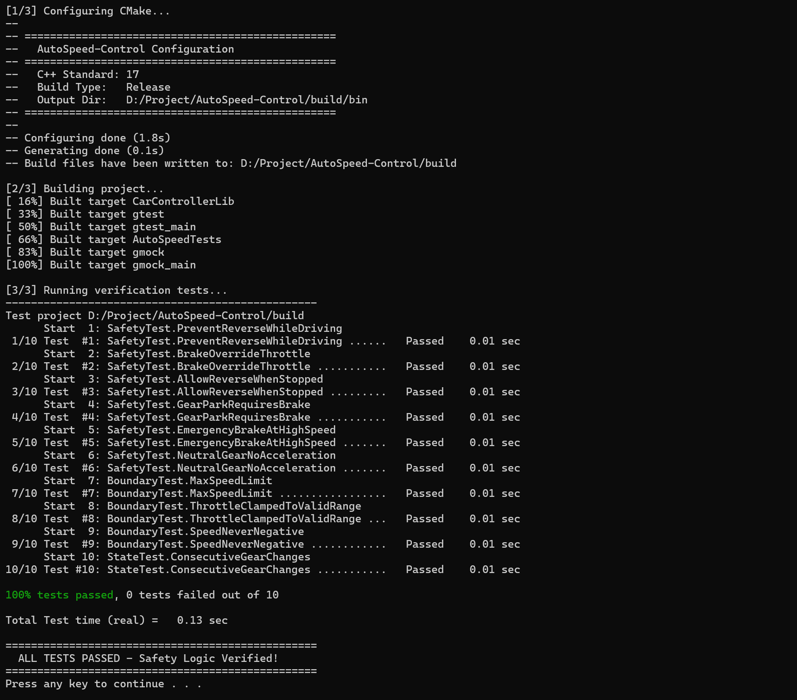
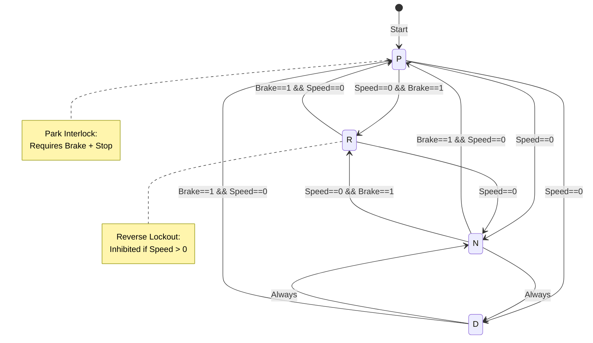

# AutoSpeed-Control (Verification Methodology Demo)

C++ Simulation of an Automotive Transmission Controller with Safety-Critical Logic Verification and CI/CD Integration. This project demonstrates the "Verification Mindset" through structural testing and boundary analysis.

This project implements a Finite State Machine (FSM) to manage vehicle gears (Park, Reverse, Neutral, Drive) and enforces safety interlocks based on real-world automotive logic (e.g., Brake Override System, Reverse Lockout).

## Key Features

- Finite State Machine (FSM): Manages gear transitions with boundary guards.
- Safety Interlocks:
    - Reverse Lock: Prevents shifting to Reverse if vehicle speed > 0.
    - Park Interlock: Requires vehicle to be at a full stop with the brake engaged to shift into Park.
    - Brake Override (BOS): Ensures braking always takes priority over throttle input.
- Unit Testing: 100% decision coverage for safety-critical states using GoogleTest.
- Verification Metrics: Implementation of Boundary Value Analysis and State Transition Testing.
- CI/CD Automation: Automated build and verification pipeline via GitHub Actions.
 
 ---
 
 ## 🏗️ Kiến trúc hệ thống (System Architecture)
 - **Core Logic**: Bộ điều khiển truyền động (Transmission Controller) được hiện thực bằng máy trạng thái (FSM).
 - **Safety Layer**: Lớp bảo vệ ngăn chặn các chuyển đổi trạng thái nguy hiểm (ví dụ: đang chạy nhanh không cho về số P).
 - **Verification Environment**: Sử dụng **GoogleTest** để thực hiện kiểm thử đơn vị (Unit Test) và kiểm tra biên (Boundary Analysis).
 
 ## 🛠️ Hướng dẫn chạy mô phỏng (Run Guidance)
 1. **Cài đặt**: Cần trình biên dịch C++17 và CMake.
 2. **Chạy Test**: 
    - Windows: Chạy file `run_tests.bat`.
    - Linux: `mkdir build && cd build && cmake .. && make && ./tests/AutoSpeedTests`.
 3. **Kết quả**: Báo cáo PASS/FAIL sẽ hiển thị trực tiếp trên Console và được tự động kiểm tra bởi GitHub Actions.
 
 ---

## ✅ Test Execution Log

### Safety Logic Verification (GoogleTest)

*Automated verification results confirming 100% decision coverage for safety-critical logic.*

---

## Architecture


```mermaid
stateDiagram-v2
    [*] --> P : Start
    
    P --> R : Speed==0 && Brake==1
    P --> N : Speed==0
    P --> D : Speed==0
    
    R --> P : Brake==1 && Speed==0
    R --> N : Speed==0
    
    N --> P : Brake==1 && Speed==0
    N --> R : Speed==0 && Brake==1
    N --> D : Always
    
    D --> N : Always
    D --> P : Brake==1 && Speed==0
    
    note right of R
        Reverse Lockout:
        Inhibited if Speed > 0
    end note
    
    note right of P
        Park Interlock:
        Requires Brake + Stop
    end note
```

## Project Structure

```text
AutoSpeed-Control/
├── src/
│   ├── CarController.h     # Logic definitions & constants
│   └── CarController.cpp   # FSM & Safety implementation
├── tests/
│   └── test_safety.cpp     # GoogleTest suites (Safety, Boundary, State)
├──.github/workflows/      # CI Automation
├── CMakeLists.txt          # Modern CMake build system
└── run_tests.bat/sh        # One-click test runners
```

## Getting Started

### Prerequisites
- C++17 compiler (GCC, Clang, or MSVC)
- CMake 3.14+

### Build and Test
To build the project and run all verification tests:

**Windows (CMD):**
```cmd
run_tests.bat
```

**Linux / macOS:**
```bash
bash run_tests.sh
```

### Manual Build
```bash
mkdir build && cd build
cmake..
cmake --build.
ctest --output-on-failure
```

## Verification Summary
The system is verified against 10 test cases covering:
- **Boundary Value Analysis**: Speed limits and throttle clamping.
- **State Transition Coverage**: All valid gear shifts.
- **Safety Assertions**: Emergency braking and inadvertent gear shift prevention.

## License
MIT License.
